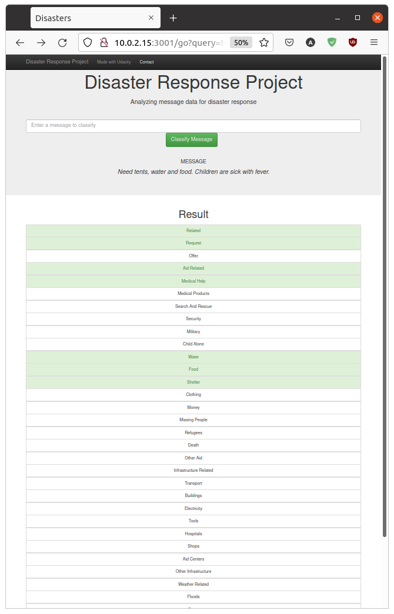

# Disaster Response Pipeline Project



## The goal of this project:

- To train a machine learning model that will classify any input message into 36 categories.

	- The categories are: related, request, offer, aid_related, medical_help, medical_products, search_and_rescue, security, military, child_alone, water, food, shelter, clothing, money, missing_people, refugees, death, other_aid, infrastructure_related, transport, buildings, electricity, tools, hospitals, shops, aid_centers, other_infrastructure, weather_related, floods, storm, fire, earthquake, cold, other_weather, direct_report.
	
## The dataset:

- Data contains 26248 samples and is stored in 2 csv tables: disaster_categories.csv, disaster_messages.csv. The data is imbalanced in such way that some categories are present much frequently ("related" has 20094 occurrences without duplicates) than others ("child_alone" has 0 occurences).

	- Table "disaster_categories.csv" contains columns:
	
		- "id" - Unique identifier of a sample message.
		- "categories" - Labeles (categories) of a sample message.
		
	- Table "disaster_messages.csv" contains columns:
	
		- "id" - Unique identifier of a sample message.
		- "message" - Sample text (input) for a machine learning model.
		- "original" - Sample text before translation into English.
		- "genre" - One of 3 sources the data was collected from.
			- News
			- Direct
			- Social

## Steps to complete:

- ETL

	- Extract from csv tables into Pandas DataFrame.
	- Transform into the multilabeled dataset and clean (remove duplicates). Then dump to SQL (sqlite3) DB.
	- Load from SQL DB.
	
- Machine Learning

	- Pipeline
	
		- Vectorization (creating sparse matrix of vocabulary tokens). Using custom tokenizer:
		
			1. Converting text to lowercase.
			2. Replacing any URLs with "urlplaceholder".
			3. Removing any non-alphanumeric symbols.
			4. Keeping only words that are not in NLTK English stopwords.
			5. Lemmatization
			6. Stemming
			
		- Normalization (Term frequency inverse document frequency) of the values in the vocab tokens matrix on the scale from 0 to 1.
		
		- Classification (applying final estimator as MultiOutputClassifier).
		
	- Training includes choosing the best hyperparameters combination with GridSearchCV.
	
	- Evaluation of the best model on the test set and printing output of classification_report with "precision", "recall" and "f1-score" on each of 36 categories and total summary.
	
- Deployment

	- Website with Flask web framework
	- SQLite database
	- Trained model saved in pickle file
	- Plotly charts
	

## Trained model evaluation:

|Label|Precision|Recall|F1-score|Support|
|---|---|---|---|---|
|related|0.83|0.91|0.87|1000|
|request|0.69|0.44|0.54|222|
|offer|1.00|0.00|0.00|13|
|aid_related|0.70|0.60|0.64|551|
|medical_help|0.48|0.25|0.33|105|
|medical_products|0.79|0.39|0.52|57|
|search_and_rescue|0.71|0.27|0.39|37|
|security|1.00|0.00|0.00|19|
|military|0.69|0.40|0.51|50|
|child_alone|1.00|1.00|1.00|0|
|water|0.73|0.61|0.67|80|
|food|0.77|0.74|0.75|142|
|shelter|0.82|0.66|0.73|108|
|clothing|0.83|0.75|0.79|20|
|money|0.33|0.08|0.13|38|
|missing_people|0.83|0.24|0.37|21|
|refugees|0.61|0.39|0.47|44|
|death|0.80|0.56|0.66|70|
|other_aid|0.47|0.17|0.25|164
|infrastructure_related|1.00|0.02|0.05|84|
|transport|0.77|0.15|0.26|65|
|buildings|0.39|0.16|0.22|58|
|electricity|0.48|0.41|0.44|27|
|tools|1.00|0.00|0.00|7|
|hospitals|1.00|0.00|0.00|15|
|shops|1.00|0.00|0.00|6|
|aid_centers|1.00|0.00|0.00|15|
|other_infrastructure|1.00|0.00|0.00|58|
|weather_related|0.83|0.71|0.77|359|
|floods|0.84|0.49|0.62|100|
|storm|0.67|0.67|0.67|111|
|fire|0.75|0.40|0.52|15|
|earthquake|0.90|0.83|0.86|134|
|cold|0.67|0.45|0.54|22|
|other_weather|0.67|0.13|0.22|76|
|direct_report|0.60|0.43|0.50|234
|---|---|---|---|---|
|micro avg|0.76|0.58|0.66|4127|
|macro avg|0.77|0.37|0.42|4127|
|weighted avg|0.75|0.58|0.62|4127|
|samples avg|0.74|0.74|0.60|4127|
	
### Requirements

- click==8.0.1
- Flask==2.0.1
- greenlet==1.1.1
- itsdangerous==2.0.1
- Jinja2==3.0.1
- joblib==1.0.1
- MarkupSafe==2.0.1
- nltk==3.6.2
- numpy==1.21.2
- pandas==1.3.3
- plotly==5.3.1
- python-dateutil==2.8.2
- pytz==2021.1
- regex==2021.8.28
- scikit-learn==0.24.2
- scipy==1.7.1
- six==1.16.0
- sklearn==0.0
- SQLAlchemy==1.4.23
- tenacity==8.0.1
- threadpoolctl==2.2.0
- tqdm==4.62.2
- Werkzeug==2.0.1

### Instructions

1. Run the following commands in the project's root directory to set up your database and model.

    - To run ETL pipeline that cleans data and stores in database
		```sh
		python data/process_data.py data/disaster_messages.csv data/disaster_categories.csv data/DisasterResponse.db
		```
		
    - To run ML pipeline that trains classifier and saves
        ```sh
        python models/train_classifier.py data/DisasterResponse.db models/classifier.pkl
        ```

2. Run the following command in the app's directory to run your web app.

    ```sh
    python run.py
    ```

3. Go to http://0.0.0.0:3001/
